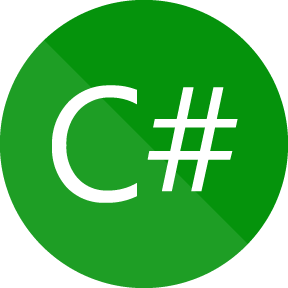
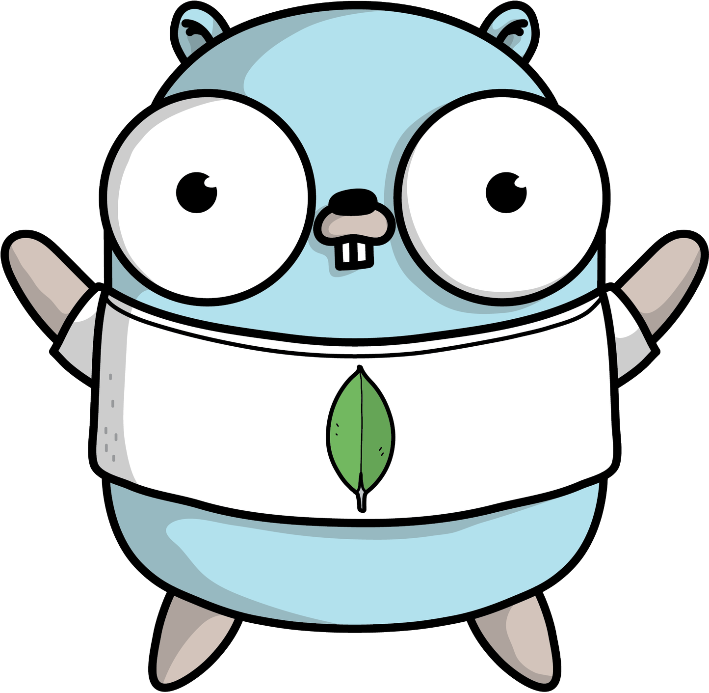
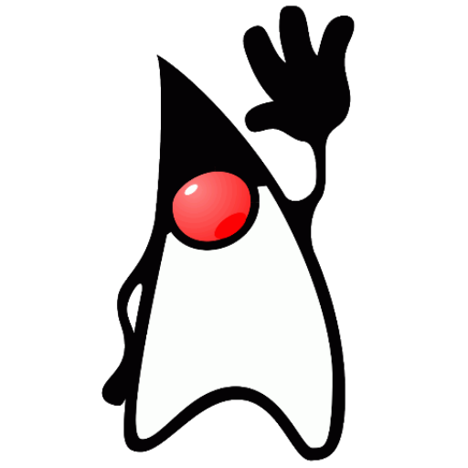

<!--suppress ALL -->

# 👋 ஐ Enabled Fish ஐ <a href="https://github.com/EnabledFish"></a> <a href="https://twitter.com/EnabledFish"></a>


```Rust
#![no_std] // This is a minimal kernel.
#![no_main]

use core::panic::PanicInfo;

#[panic_handler]
fn panic(_info: &PanicInfo) -> ! { loop {} }

#[no_mangle]
pub extern "C" fn _start() -> ! {
    let message = "Hi, I am Enabled Fish!"; // ☬
    let buffer = 0xb8000 as *mut u8;
    for (i, &b) in message.as_bytes().iter().enumerate() {
        unsafe { // ☈
            *buffer.offset(i as isize * 2) = b;
            *buffer.offset(i as isize * 2 + 1) = 0xb;
        }
    }
    loop {}
}
```

# 📕 ❀ Environment ❀

<code></code>
<code></code>
<code></code>
<code></code>
<code></code>
<code></code>
<code></code>
<code></code>
<code></code>
<code></code>

# 📃 〄 Analysis 〄


# 📞 ❅ Contact ❅

```text
Github: @EnabledFish
Twitter: @EnabledFish
```

[](https://github.com/EnabledFish)
[](https://github.com/EnabledFish)
